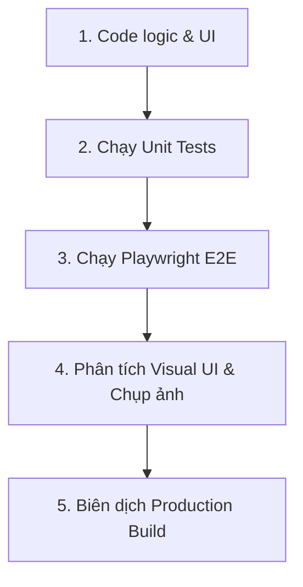

# Quy trình Phát triển & Kiểm thử tự động (Last SSH Development Workflow)

Tài liệu này ghi nhận vĩnh viễn quy trình phát triển tính năng mới, kiểm thử tự động và đảm bảo chất lượng của dự án **Last SSH**. Điều này giúp các phiên làm việc (sessions) sau luôn tuân thủ đúng tiêu chuẩn chất lượng cao nhất mà không cần hướng dẫn lại.

---

## 1. Chu trình Phát triển Tính năng Mới (Feature Development Loop)

Mỗi khi bổ sung một tính năng hoặc thay đổi giao diện, hãy đi qua 5 bước nghiêm ngặt sau:



### Bước 1: Phát triển Mã nguồn (Code & Design)
* Viết code UI React sạch sẽ trong `src/components/` và logic nghiệp vụ trong `src/services/`.
* **Quy chuẩn Thiết kế:** 
  - Tuân thủ Glassmorphism cao cấp, sử dụng bảng màu HSL Tailored.
  - KHÔNG sử dụng TailwindCSS (trừ khi có yêu cầu rõ ràng). Tất cả style phải nằm trong các file `.css` tương ứng bằng CSS thuần.
  - Tuyệt đối không hardcode mã màu `#` trong các tệp CSS của component, bắt buộc sử dụng CSS variables trong `src/index.css` để hỗ trợ đổi theme động.

### Bước 2: Chạy bộ Unit Tests (Vitest)
* Đảm bảo logic nghiệp vụ độc lập hoạt động chính xác.
* Chạy lệnh:
  ```bash
  npm run test:run
  ```
* Nếu có viết thêm file logic mới, bắt buộc phải viết thêm file test tương ứng trong `src/__tests__/` với hậu tố `.test.js` hoặc `.test.jsx`.

### Bước 3: Chạy bộ kiểm thử trình duyệt thực tế (Playwright E2E)
* Đảm bảo luồng tương tác thực của người dùng không bị hỏng (Màn hình khóa PIN, SFTP kéo thả, WebRTC sync chéo trình duyệt).
* Chạy lệnh:
  ```bash
  npm run test:e2e
  ```
* Hoặc mở giao diện trực quan E2E để gỡ lỗi (debug):
  ```bash
  npm run test:e2e:ui
  ```

### Bước 4: Chụp và phân tích giao diện trực quan (Visual UI Testing)
* Tự động kiểm tra độ sắc nét, cân đối và tương phản của CSS trên trình duyệt thật.
* Chạy lệnh:
  ```bash
  npx playwright test e2e/visual.spec.js
  ```
* Các tệp ảnh chụp màn hình sẽ được xuất ra thư mục `test-results/screenshots/`. Hãy trực tiếp xem các ảnh này để tối ưu giao diện:
  - `screenshot_main_screen.png` (Màn hình chính)
  - `screenshot_settings_appearance.png` (Tab tùy biến giao diện)
  - `screenshot_settings_keys.png` (Tab quản lý SSH Keys)
  - `screenshot_lock_screen.png` (Màn hình khóa PIN)

### Bước 5: Kiểm thử biên dịch Production (Vite Build)
* Luôn đảm bảo dự án có khả năng đóng gói hoàn hảo, không có lỗi cú pháp hay cảnh báo biên dịch.
* Chạy lệnh:
  ```bash
  npm run build
  ```

---

## 2. Hướng dẫn sửa các lỗi thường gặp (Troubleshooting Gotchas)

### Lỗi `ECONNREFUSED` khi chạy Unit Test với Happy DOM
* **Nguyên nhân:** Thư viện `happy-dom` (môi trường giả lập DOM cho Vitest) tự động kết nối qua WebSocket tới cổng 3000 khi tạo đối tượng `BroadcastChannel` trong tệp `p2pService.js` hoặc `p2pService.test.js`.
* **Cách xử lý:** Chỉ cho phép khởi tạo `BroadcastChannel` thực sự khi phát hiện đang chạy trong môi trường E2E thực của trình duyệt (`window.__e2e__ === true`), các trường hợp khác dùng Mock Channel offline trong bộ test.

### Lỗi Dialog Alert của Trình duyệt chặn Playwright
* **Nguyên nhân:** Khi lưu cấu hình hoặc hiển thị thông báo, ứng dụng gọi lệnh `alert()` của trình duyệt, lệnh này chặn đứng tiến trình click của Playwright nếu không được xử lý.
* **Cách xử lý:** Đăng ký hàm bắt Dialog trước khi thực hiện hành động click trong file spec:
  ```javascript
  page.once('dialog', async dialog => {
    await dialog.accept(); // hoặc kiêm tra nội dung: expect(dialog.message()).toContain('thành công');
  });
  ```

### Sửa đổi Theme Terminal độc lập với Giao diện ứng dụng
* Giao diện ứng dụng (App Theme) được điều phối thông qua lớp theme đặt trên `document.body` (ví dụ: `document.body.className = 'theme-glass-aura'`).
* Giao diện Terminal (Terminal Theme) được điều phối độc lập bằng cách truyền class trực tiếp vào container của nó (ví dụ: `<div className="terminal-container theme-dracula">`). Do đó, terminal có thể hiển thị nền tối sâu chuyên nghiệp ngay cả khi layout bên ngoài là theme sáng màu.
