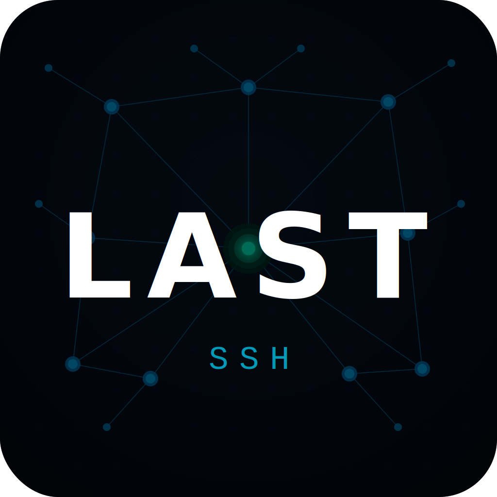

<div align="center">
  
</div>

# Last SSH

[](https://github.com/The-Last-Devops/Last-SSH/actions/workflows/build.yml)
[](https://github.com/The-Last-Devops/Last-SSH/pkgs/container/last-ssh)

A modern SSH/SFTP client available as both a **Desktop app** (Electron) and a **Web app** (self-hosted via Docker). Built with React 19, Vite, and Node.js.

```bash
docker run -p 3000:3000 ghcr.io/the-last-devops/last-ssh:latest
```

Open [http://localhost:3000](http://localhost:3000) in your browser.

## 🚀 Key Features

- **Smart Server Management**: Batch manage Servers (Hosts) by Group with a user-friendly and intuitive interface.
- **Device Data Synchronization (P2P)**: Securely synchronize configurations, server lists, and keys across multiple devices via a WebRTC peer-to-peer network, ensuring your data remains private without relying on a central server.
- **Ultra-Smooth Terminal**: Uses `xterm.js` to simulate a realistic command-line interface, supporting keyboard shortcuts and advanced color customization.
- **Security Key Management (Keychain)**: Supports creating, storing, and connecting securely using your own Private Keys.
- **File Transfer (SFTP Browser)**: Manage server directories with ease, providing seamless upload and download functionality for your files.
- **Dark/Light Theme**: Automatically adapt or manually set the theme to match your preferred working environment.

## 🛠️ Technology Stack

- **Frontend**: React 19, Vite
- **UI/UX**: Vanilla HTML/CSS (Tailored HSL design)
- **Desktop Core**: Electron
- **SSH/Terminal**: `ssh2` (Node.js SSH connection), `xterm.js` (command-line interface)
- **Networking**: `peerjs` (WebRTC for data synchronization)

## 📦 Development Setup

Prerequisites: **Node.js** installed (version 24+ recommended).

1. Clone this repository to your machine.
2. Open the terminal and install the dependencies:
   ```bash
   npm install
   ```
3. Run the application in the Development environment (both React and Electron will start simultaneously):
   ```bash
   npm run dev:desktop
   ```
> Note: If port `5173` is in use, please run `lsof -ti:5173 | xargs kill -9` (on MacOS/Linux) to kill the stuck process before running again.

## 🔄 Device Data Synchronization (P2P Sync)

Last SSH supports **peer-to-peer data synchronization** between devices using WebRTC (via PeerJS). No cloud server involved — data is encrypted with AES-GCM before transmission.

**What gets synced:** SSH hosts, private keys, identities, settings, and virtual filesystem.

### How to Sync

**Requirements:** Both devices must be running Last SSH and connected to the internet.

**Step 1 — Open P2P Sync on BOTH devices**

Go to **Sync Data** in the sidebar. Wait 3–5 seconds for initialization. When the Sync Key appears, the device is ready.

**Step 2 — Share the Sync Key**

- **Device A** (sender): Click **"Send Data"** — a Sync Key will be displayed (valid for 5 minutes). Copy and share it with Device B.
- **Device B** (receiver): Click **"Receive Data"**, paste the Sync Key and click **"Connect & Sync"**.

Both devices will show a connected status when paired.

**Step 3 — Transfer data**

- **Device A**: Click **"Send Data to Device"** to push all settings, hosts, keys, and identities to Device B.
- **Device B**: Data is automatically applied upon receipt.

> **Quick test on one machine:** Open two Last SSH windows, use the Sync Key from window 1 and enter it in window 2.

> **Troubleshooting:** If the connection fails, check your internet connection. Connections through strict corporate firewalls may need a VPN.

## 🔨 Build Instructions (Packaging the App)

The application supports cross-platform packaging thanks to the `electron-builder` library.

### Manual Local Build

1. First, build the static web interface:
   ```bash
   npm run build
   ```
2. Then, run the packaging command according to your operating system:
   - **MacOS**: `npm run build:mac`
   - **Windows**: `npx electron-builder --win`
   - **Linux**: `npx electron-builder --linux`

The packaged installation files (such as `.dmg`, `.exe`, `.AppImage`) will be saved in the `dist-electron` folder.

## 🐳 Docker (Web Version)

The web version runs as a self-hosted Node.js server with real SSH/SFTP support.

**Docker image:** `ghcr.io/the-last-devops/last-ssh:latest`

### Quick start

```bash
docker run -d \
  -p 3000:3000 \
  -v last-ssh-data:/data \
  --name last-ssh \
  ghcr.io/the-last-devops/last-ssh:latest
```

### Docker Compose

```yaml
services:
  last-ssh:
    image: ghcr.io/the-last-devops/last-ssh:latest
    ports:
      - "3000:3000"
    volumes:
      - last-ssh-data:/data
    restart: unless-stopped

volumes:
  last-ssh-data:
```

### Environment variables

| Variable | Default | Description |
|----------|---------|-------------|
| `PORT` | `3000` | HTTP/WebSocket port |
| `DATA_DIR` | `~/.last-ssh-web` | Directory for `store.json` and `known_hosts.json` |

## Kubernetes Deploy

Manifests are in the [`k8s/`](k8s/) directory.

```bash
# 1. Edit k8s/ingress.yaml — replace ssh.yourdomain.com with your domain
# 2. Apply all manifests
kubectl apply -f k8s/

# Verify
kubectl get pods,svc,ingress
```

Files:
- [`k8s/deployment.yaml`](k8s/deployment.yaml) — Deployment + PersistentVolumeClaim
- [`k8s/service.yaml`](k8s/service.yaml) — ClusterIP Service
- [`k8s/ingress.yaml`](k8s/ingress.yaml) — Ingress with WebSocket + TLS (nginx + cert-manager)

> Requires: nginx ingress controller, cert-manager with a `letsencrypt-prod` ClusterIssuer.
