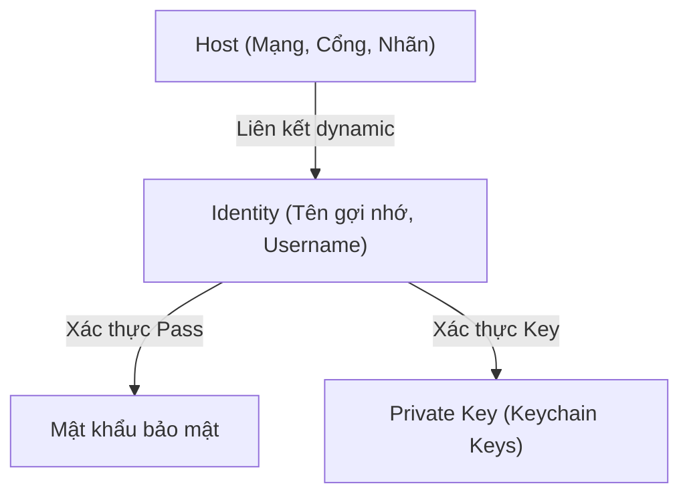

# Kế hoạch Triển khai: Quản lý Credentials Identities & Sửa lỗi Kết nối SSH Thật

Để giải quyết vấn đề kết nối SSH thật bị lỗi và đáp ứng yêu cầu cực kỳ tiện lợi của bạn - **tích hợp tính năng quản lý Credentials Identities giống như Termius** (quản lý tập trung các tài khoản user/password hoặc user/key để chọn nhanh từ dropdown khi thêm host, không cần nhập thủ công), chúng ta sẽ thực hiện nâng cấp hệ thống dữ liệu và giao diện Keychain của ứng dụng.

---

## 1. Phát hiện Kỹ thuật & Sửa lỗi Kết nối SSH Thật

> [!IMPORTANT]
> **Nguyên nhân lỗi kết nối SSH thực tế:**
> Khi kết nối SSH bằng Key, tiến trình Electron Main Process cần nội dung tệp Private Key (`profile.keyContent`) để xác thực. Tuy nhiên, trong mã nguồn cũ, khi bấm CONNECT, Host Profile gửi đi chỉ chứa ID của khóa (`keyId`) mà không hề chứa nội dung thực tế của khóa đó. Điều này khiến Electron Main Process không có thông tin xác thực và gây ra lỗi kết nối.
>
> **Giải pháp khắc phục:**
> Chúng ta sẽ thực hiện phân giải (resolve) tự động nội dung khóa `keyContent` từ `keyId` và gán trực tiếp vào Host Profile ngay trước khi khởi chạy phiên kết nối SSH. Cơ chế này áp dụng cho cả SSH Key nhập thủ công lẫn SSH Key được cấu hình thông qua tính năng **Identity** mới.

---

## 2. Thiết kế Hệ thống Quản lý Credentials Identities

Một **Identity** (Định danh) đóng gói toàn bộ thông tin tài khoản dùng để kết nối đến máy chủ từ xa:



### Cấu trúc dữ liệu Identity:
```javascript
{
  id: "identity-123456",
  label: "kien'ssh(sen)",     // Nhãn hiển thị gợi nhớ
  username: "kiennt",          // SSH Username thật
  authType: "key",             // 'password' hoặc 'key'
  password: "",                // Sử dụng nếu authType === 'password'
  keyId: "key-987654"          // Liên kết với Private Key trong Keychain (nếu authType === 'key')
}
```

### Cách thức hoạt động:
1. **Keychain Manager**: Thêm một mục quản lý **Identities** song song với **Keys** ở tab Keychain (chuẩn giao diện Termius). Cho phép Thêm, Sửa, Xóa các Credentials Identities.
2. **Host Configuration Pane**: Trong biểu mẫu cấu hình Host, bổ sung Dropdown **"Credentials Identity"**.
   - Nếu chọn `Nhập thủ công (None)`: Hiển thị các ô nhập Username, Password, và Linked Key như bình thường (tương thích ngược 100%).
   - Nếu chọn một Identity cụ thể: Ẩn/Disabled các ô nhập Username, Password, Linked Key đi vì chúng sẽ được kế thừa tự động từ Identity.
3. **SSH Connection Resolver**: Khi người dùng nhấn CONNECT, hệ thống tự động trích xuất thông tin username, password, hoặc keyContent từ Identity tương ứng để thiết lập kết nối SSH thật và SSH giả lập.

---

## 3. Các Thay đổi & Xây dựng Đề xuất (Proposed Changes)

### [Modify] Quản lý State & Đồng bộ hóa toàn cục
#### [MODIFY] [App.jsx](file:///Users/KienNT/Code/kien/terminus-clone/src/App.jsx)
- Thêm state `identities`: `const [identities, setIdentities] = useState([]);`.
- Đồng bộ lưu trữ mã hóa và giải mã `identities` trong LocalStorage hoặc Encrypted Storage (khi sử dụng mã PIN) tương tự như `connections` và `keys`.
- Bổ sung các hàm callback quản lý: `handleAddIdentity`, `handleEditIdentity`, `handleDeleteIdentity`.
- **Nâng cấp hàm `handleConnectSSH`**:
  - Tự động phân giải thông tin `username`, `password`, `keyId` nếu Host có cấu hình liên kết `identityId`.
  - Phân giải chính xác nội dung khóa `keyContent` từ `keyId` và gán vào profile trước khi truyền sang Electron qua IPC.

### [Modify] Giao diện Keychain & Hosts Dashboard
#### [MODIFY] [HostsDashboard.jsx](file:///Users/KienNT/Code/kien/terminus-clone/src/components/HostsDashboard.jsx)
- Nhận prop `identities`, `onAddIdentity`, `onDeleteIdentity` từ App.jsx.
- **Tại tab Keychain**: Thiết kế giao diện quản lý Keychain chuẩn đẹp chia làm 2 phần:
  - **Keys**: Quản lý tệp khóa PEM (giữ nguyên và làm đẹp).
  - **Identities**: Thêm form đăng ký Identity mới (Nhãn, Username, Loại xác thực: Password hoặc Private Key). Hiển thị danh sách các Identities dưới dạng các card trực quan.
- **Tại Host Details Pane**:
  - Thêm dropdown chọn **Credentials Identity** (liệt kê danh sách Identities hiện có).
  - Điều chỉnh ẩn/hiện hoặc disabled các ô nhập Username/Password/Key thủ công dựa trên lựa chọn Identity của người dùng.

---

## 4. QUY TRÌNH BẮT BUỘC SAU KHI CẬP NHẬT CODE

> [!IMPORTANT]
> **Quy trình Kiểm tra Cú pháp & Kiểm thử Bắt buộc:**
>
> 1. **Kiểm tra cú pháp & Linter**:
>    - Chạy lệnh `npm run lint` để đảm bảo code sạch lỗi 100%, không bị cảnh báo biến thừa hoặc sai cú pháp module.
> 2. **Chạy các bộ kiểm thử tự động**:
>    - Chạy unit tests: `npm run test:run` để bảo vệ logic lưu trữ và giải mã an toàn.
>    - Chạy Playwright E2E tests: `npm run test:e2e` để đảm bảo các kịch bản kiểm thử tự động trên trình duyệt Chromium thật vẫn hoạt động trơn tru 100%.
> 3. **Xác minh trực quan trên Desktop**:
>    - Chạy `npm run dev:desktop`, thêm mới Key, tạo mới Identity, tạo Host liên kết với Identity đó và bấm CONNECT để kiểm chứng kết nối SSH thật và SFTP thật trơn tru 100%.

---

## 5. Kế hoạch Kiểm thử & Xác minh (Verification Plan)

### Kiểm thử thủ công:
1. Chạy `npm run dev:desktop`.
2. Mở tab **Keychain**, thêm mới một Private Key (chọn từ máy tính).
3. Thêm mới một **Identity** sử dụng Private Key vừa tạo (ví dụ nhãn `kien-auth`).
4. Mở tab **Hosts**, tạo Host mới, tại mục **Credentials Identity** chọn `kien-auth`. Đảm bảo các ô nhập mật khẩu và key thủ công tự động chuyển trạng thái.
5. Nhấn **CONNECT**, xác minh kết nối SSH thực tế thành công rực rỡ và bảng SFTP bên phải duyệt tệp realtime bình thường.

### Kiểm thử tự động:
- Chạy `npm run test:run` và `npm run test:e2e` xác nhận **100% Passed**.

---

## 6. Bạn có phê duyệt kế hoạch này không?

> [!IMPORTANT]
> **Hãy cho tôi biết nếu bạn phê duyệt kế hoạch nâng cấp Credentials Identities và sửa lỗi kết nối SSH này!**
> Ngay khi nhận được sự phê duyệt từ bạn, tôi sẽ tiến hành cập nhật mã nguồn để đem lại tính năng Keychain hoàn hảo nhất chuẩn Termius cho bạn!
